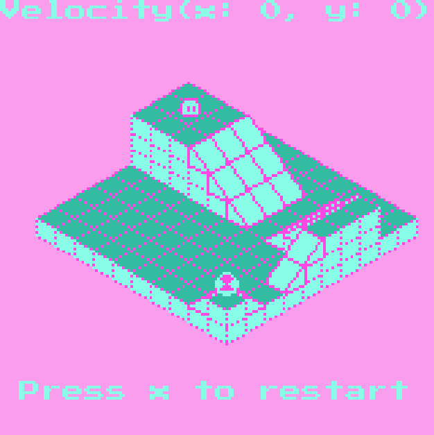
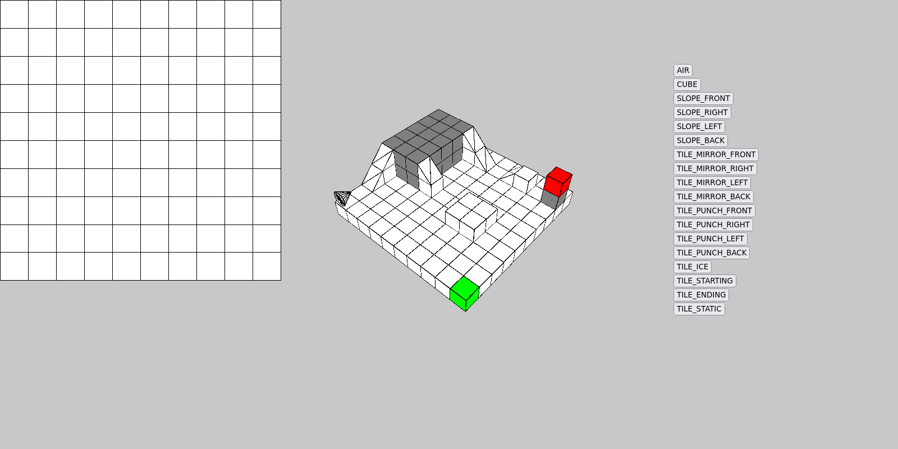

# Rolly Dango

Rolly Dango, an isometric rolling puzzle made with [WASM-4](https://wasm4.org/) by [@samX500](https://github.com/samX500) and [@willGuimont](https://github.com/willGuimont).

[Try the game here](https://willguimont.github.io/rolly-dango/) or on [itch.io](https://willguimont.itch.io/rolly-dango)!



Here's some key points of our project:

- We made our own ECS (entity-component-systems) from scratch
- To save cartridge space, we built our own Huffman coding algorithm
- To help ourselves make levels, we built our own level editor using [p5.js](https://p5js.org/)
- Made all of our sprites using [Aseprite](https://www.aseprite.org/)

Our level editor:


## Dependencies

You'll need a nightly version of Nim because we need the `-d:nimNoQuit` from this [pull request](https://github.com/nim-lang/Nim/pull/19419/files). To do so, install the latest nightly with:

```bash
choosenim devel --latest
```

Optionally, you can install [binaryen](https://github.com/WebAssembly/binaryen) to optimize further the binary size.

## Build cartridge

```bash
# Debug mode
nimble dbg
# Release mode
nimble rel
```

## Run the tests

```bash
nimble test
```

## Deploy to GitHub-Pages

```bash
./deploy.sh
```

## Running the cartridge

```bash
# Run compiled cartridge in your web browser
w4 run build/cart.wasm
# Run with hot reloading
w4 watch
# Run natively
w4 run-native build/cart.wasm
```

## Useful tools

### [png2src](https://wasm4.org/docs/reference/cli#png2src)

```bash
w4 png2src --nim top.png down.png left.png right.png
```

### [bundle](https://wasm4.org/docs/reference/cli#bundle)
```bash
w4 bundle --html build/html/index.html --title Dango --description "Rolling puzzle game" --icon-file "assets/sprites/dangoBeeg.png" build/cart.wasm
w4 bundle --linux dango carts/cart.wasm
```
